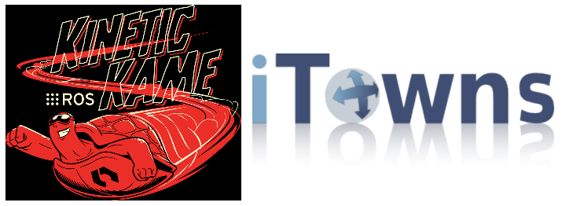
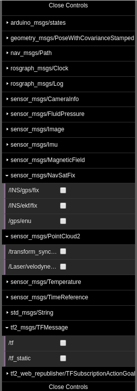

# ROS + iTowns

Ce projet a pour but d'intégrer des données issues des acquisitons ROS dans la plateforme iTowns. 


        
Pour cela, nous nous basons sur les bibliothèques ROSlibjs, qui permet d'extraire des informations de messages prédéfinis, et ROS3Djs qui permet d'afficher les données en webGL. 
Seulement la surcouche webGL d'iTowns n'est pas compatible avec le surcouche webGL de ROS 3D, il faut donc adapter les deux librairies.




## Table des matières

1. [Installation](#installation-sur-ubuntu)
2. [Implémentation](#impl%C3%A9mentation)
3. [Lancement de l'application](#lancement-de-lacquisiton)
4. [API](#api)
5. [Problèmes rencontrés](#probl%C3%A8mes-rencontr%C3%A9s)
6. [Conclusion](#conclusion) 

## Installation sur ubuntu

### iTowns
On peut trouver l'ensemble du projet itowns à l'adresse suivante : https://github.com/iTowns/itowns/tree/ros         


Pour l'installer, il suffit alors de cloner l'adresse suivante dans un dossier prévu à cette effet : 

                                 $ git clone https://github.com/iTowns/itowns.git

Sur iTowns, une branche (ros) est dédiée à l'ajout des données provenant d'acquisitons avec ROS.    
Il faut alors se rendre dans cette branche : `$ git checkout ros`   
Puis installer les dépendances nécessaires au bon fonctionnement de l'application : `$ npm install`   
Et enfin mettre en route l'application : `$ npm start`

### ROS
Afin d'avoir accès à tous les outils nécessaires à l'utilisation de ROS dans ce projet, il est nécessaire d'installer plusieurs modules :   
* [ROS Kinetic](wiki.ros.org/kinetic/Installation/Ubuntu) - Gestion des différents flux d'informations
* [ROSBride](wiki.ros.org/rosbridge_suite/Tutorials/RunningRosbridge) - Proxy qui donne accès aux flux d'informations
* [Roslibs.js](wiki.ros.org/roslibjs) - Permet la connexion de la websocket de ROS au Bridge
* [Ros3D.js](wiki.ros.org/ros3djs) - Permet l'ajout d'objet THREE.js au projet

**[Retour en haut de la page](#table-des-matières)** 

## Implémentation

L'implémentation comprend plusieurs étapes : 
- Création et diffusion des données ROS (webSockets)
- Récupération des différents messages proposés par ROS 
- Création d'un menu en fonction des messages reçus
- Interaction avec le menu par le biais d'un affichage des données (utilisation des handlers existants et création si besoin)
- Correction de la librairie ros3Djs
- Affichage des données ROS et tests en localhost
- *Re-agencement des repères de chaque message*
- *Intégration de l'implémentation dans iTowns*

## Lancement de l'acquisiton

### Initialisation de l'environnement

Il est tout d'abord primordial d'entrer la commande suivante dans chacun des terminaux que nous utiliserons.
```
source /opt/ros/kinetic/setup.bash
```
Cette ligne de commande permet en effet de configurer l'environnement ROS de travail. 

### Lancement du serveur

Pour lancer le serveur websocket de ROS il faut entrer la commande suivante dans un terminal indépendant : 
```
roslaunch rosbridge_server rosbridge_websocket.launch
```
Cette commande permet de créer la connexion entre la websocket de ROS et le Bridge (proxy).        
L'écoute des données s'effectue en local sur le port 9090. 

### Lancement du RosBag de test

Afin de produire un flux de données utiles, on utilise un document BAG.    
Dans un nouveau terminal, on lance la lecture du document en utilisant la commande suivante : 
```
rosbag play -l  LIEN VERS LE DOCUMENT BAG
```
L'option -l permet de faire tourner le document en boucle pour effectuer nos tests sur un document qui contient peu de données et qui est donc plus facilement portable. 

### Recupération des données 
Une fois ces opérations terminées, il est possible de récupérer les données dans le document source en javascript. Pour cela, on crée un objet roslib qui accède au données par le biais de l'URL sur lequel tourne le rosbridge (ici, localhost:9090). Différents écouteurs d'évènements permettent alors de récupérer les données. En particulier, la fonction *getTopics* accède aux topics afin de lancer la fonction de traitement.

**[Retour en haut de la page](#table-des-matières)** 

## API

### Les messages proposés



Ce menu de messages est obtenu en récupérant le flux de données issus de la websocket de ROS. Réalisé avec *dat.gui*, il est obtenu après récupération des topics : il s'adapte aux topics disponibles dans le rosbag actuel. Cocher un élément de ce menu permet de souscrire au topic correspondant et d'effectuer le traitement du message.

### Visualisation des résultats

Les messages actuellement pris en compte par l'application sont : 
- tf2_msgs/TFMessage : données de base sur les différents repères. Il est nécessaire de le cocher avant tout traitement.
- sensor_msgs/NavSatFix : données de position du porteur.  
*Affiche une ligne rouge suivant les coordonnées au cours du temps*
- geometry_msgs/PoseWithCovarianceStamped : données de position des caméras.  
*Affiche des carrés qui représente la caméra*
- sensor_msgs/PointCloud2 : nuage de points récupéré par les équipements de mesure (n'est pas fonctionnel).   
*Est supposé afficher un nuage de point représentant les données scannées. Ces points ne sont pas visibles bien qu'ils soient présents dans la scène finale (visible grâce à la commande `console.log(view.scene)`).* 

## Problèmes rencontrés

### Librairie ROS3Djs non fonctionnelle

La fonction centrale que nous devions utiliser dans cette librairie *handlePointCloud2* n'est pas fonctionnelle en l'état. Une issue non encore résolue est d'ailleurs ouverte sur le github de ROS3Djs à ce sujet. En effet, elle utilise une version obsolète de threejs.      

2 options s'offraient alors à nous pour corriger ce problème : 
- recréer la fonction *handlePointCloud2* pour qu'elle ne dépende plus de ros3djs 
- corriger la fonction utilisée dans ros3djs pour qu'elle dépende plus des fonctionnalités obsolètes de threejs

Nous avons choisis la seconde option en remplaçant les *geometry* par les *buffergeometry*. Ainsi, certaines propriétés du shader ont migré à l'intérieur de la géometrie.  

La librairie que nous utilisons actuellement est hébergée à [cette adresse](https://github.com/RoseMathelier/ros3djs).
Il était nécessaire de compiler et de pousser les changements afin de les tester, ce qui a rendu le développement assez lourd. En effet, le lien à inclure dans le fichier javascript, généré grâce à l'outil *rawgit*, devait changer en fonction du numéro de commit pour se mettre à jour.


### Documentation limitée 

La documentation disponible sur ROS et en particulier sur les messages et leur utilisation est limitée. Cela rend la lecture et le traitement des messages compliquée.      
Par exemple pour la lecture des sensor_msgs/Camerainfo, il n'y avait aucune indication sur la façon de lier ce message à celui de positionnement dans le tf2_msgs/TFMessage. 

**[Retour en haut de la page](#table-des-matières)** 

## Conclusion

En l'état actuel le projet n'est pas terminé. En effet, le problème de l'affichage des points n'ayant pas été résolu nous n'avons pas pu poursuivre le traitement des données.     
Nous avons donc réalisé l'implémentation jusqu'à l'étape des tests d'affichage des données (en local). L'étape suivante (une fois le bug corrigé) serait alors de mettre toutes les données dans un repère unique grâce aux messages récupérés dans /tf puis de visualiser ces éléments dans itowns.    
       
De plus, ce projet ne nous a pas permis de passer beaucoup de temps sur les problématiques directement liées à la 3D et à son traitement sur iTowns, les erreurs en amont étant trop importantes. Ainsi, une majorité du temps de projet a été consacrée à la compréhension de la structure des données ROS et des librairies associées pour le développement en javascript, mais également à la correction des erreurs de celles-ci.   
   
Cependant, nous avons pu rendre fonctionnelle la librairie ROS3Djs et l'utiliser correctement dans notre code, et construire plusieurs gestionnaires pour une partie des messages. En outre, le code actuel peut facilement être complété avec d'autres  gestionnaires, en rajoutant simplement les fonctions nécessaires. Chaque message disponible est en effet détecté et apparaît automatiquement dans le menu utilisateur.

**[Retour en haut de la page](#table-des-matières)** 

## Authors

* **Rose Mathelier**
* **Augustin Gagnon**
* **Laure Le Breton**

**[Retour en haut de la page](#table-des-matières)** 
